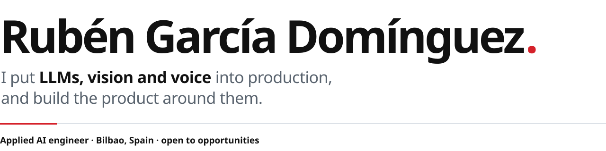
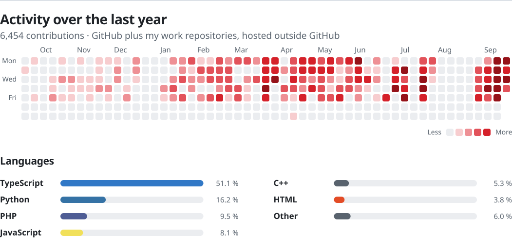

<a href="https://rubengarcia.pages.dev">
<picture>
  <source media="(prefers-color-scheme: dark)" srcset="assets/banner-es-oscuro.svg">
  
</picture>
</a>

Construyo sistemas de IA que funcionan en producción: visión artificial sobre vídeo en directo, lectura de documentos con OCR y modelos de visión, y agentes con LLMs en hardware propio. También hago el producto que los rodea, de la API al despliegue en Kubernetes, y sigo manteniendo lo que pongo en marcha.

### Trabajo destacado

Estos repositorios son privados, así que cuento lo que hacen.

- Un RAG agéntico en local, hecho entre dos, que funciona entero en una NVIDIA H200. Guarda más de 9 millones de fragmentos, usa búsqueda híbrida con reranking y da a sus agentes más de 30 herramientas. Subí el recall@20 del 39 % al 51 % y bajé la extracción de un PDF de 525 páginas de más de 11 minutos a 14 segundos. vLLM · Qwen3 · pgvector · PaddleOCR-VL · FastAPI · React
- Un contador de personas en tiempo real para instalaciones públicas que lee varias cámaras a la vez. Cada GPU tiene su propio pipeline de DeepStream, con hasta 7 Tesla T4 orquestadas en Kubernetes y modelos ONNX que se pueden revertir. DeepStream · Savant · YOLOv11 · RF-DETR · Kubernetes
- Un pipeline que convierte la foto de un ticket en JSON validado con OCR y un LLM de visión, por unas 280 veces menos que las APIs comerciales de OCR. PaddleOCR · Gemini · SAM · Node.js · RabbitMQ

### Proyectos personales

- [Jarvis](https://rubengarcia.pages.dev/proyectos/jarvis/) es un asistente de voz para el escritorio. Las órdenes simples se resuelven en 391 ms sin LLM; el resto va a un agente cuyas acciones pasan un control de seguridad antes de tocar el equipo.
- [Inmo-Sniper](https://rubengarcia.pages.dev/proyectos/inmo-sniper/) es un radar de pisos autoalojado para Bizkaia. Descarta los anuncios trampa y compara cada precio con el mercado de su municipio.

Las capturas, la arquitectura y las decisiones de los dos están en [rubengarcia.pages.dev](https://rubengarcia.pages.dev).

<picture>
  <source media="(prefers-color-scheme: dark)" srcset="assets/actividad-es-oscuro.svg">
  
</picture>

[LinkedIn](https://www.linkedin.com/in/ruben-garcia-dominguez-6b2564116/) · 07rubengarcia@gmail.com

<b>🇬🇧 Read in English</b>

 

<a href="https://rubengarcia.pages.dev">
<picture>
  <source media="(prefers-color-scheme: dark)" srcset="assets/banner-en-oscuro.svg">
  
</picture>
</a>

I build AI systems that run in production: computer vision on live video, document reading with OCR and vision models, and LLM agents on local hardware. I also build the product around them, from the API to the Kubernetes deployment, and I keep running what I ship.

### Selected work

These repositories are private, so here is what they do.

- A local agentic RAG, built in a team of two, that runs entirely on one NVIDIA H200. It holds over 9M chunks, uses hybrid search with reranking and gives its agents more than 30 tools. I raised recall@20 from 39% to 51% and cut the extraction of a 525-page PDF from over 11 minutes to 14 seconds. vLLM · Qwen3 · pgvector · PaddleOCR-VL · FastAPI · React
- A real-time people counter for public facilities that reads several cameras at once. Each GPU runs its own DeepStream pipeline, with up to 7 Tesla T4s orchestrated in Kubernetes and ONNX models that can be rolled back. DeepStream · Savant · YOLOv11 · RF-DETR · Kubernetes
- A pipeline that turns a photo of a receipt into validated JSON with OCR and a vision LLM, at roughly 1/280 of the cost of commercial OCR APIs. PaddleOCR · Gemini · SAM · Node.js · RabbitMQ

### Personal projects

- [Jarvis](https://rubengarcia.pages.dev/proyectos/jarvis/) is a desktop voice assistant. Simple commands run in 391 ms without an LLM; anything else goes to an agent whose actions pass a safety check before they touch the computer.
- [Inmo-Sniper](https://rubengarcia.pages.dev/proyectos/inmo-sniper/) is a self-hosted housing radar for Bizkaia. It drops scam listings and compares each price with the market in its municipality.

Screenshots, architecture and the decisions behind both are on [rubengarcia.pages.dev](https://rubengarcia.pages.dev).

<picture>
  <source media="(prefers-color-scheme: dark)" srcset="assets/actividad-en-oscuro.svg">
  
</picture>

[LinkedIn](https://www.linkedin.com/in/ruben-garcia-dominguez-6b2564116/) · 07rubengarcia@gmail.com

